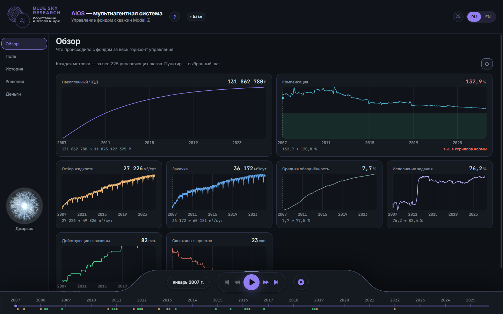
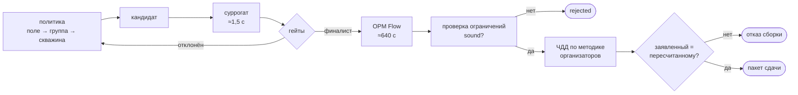
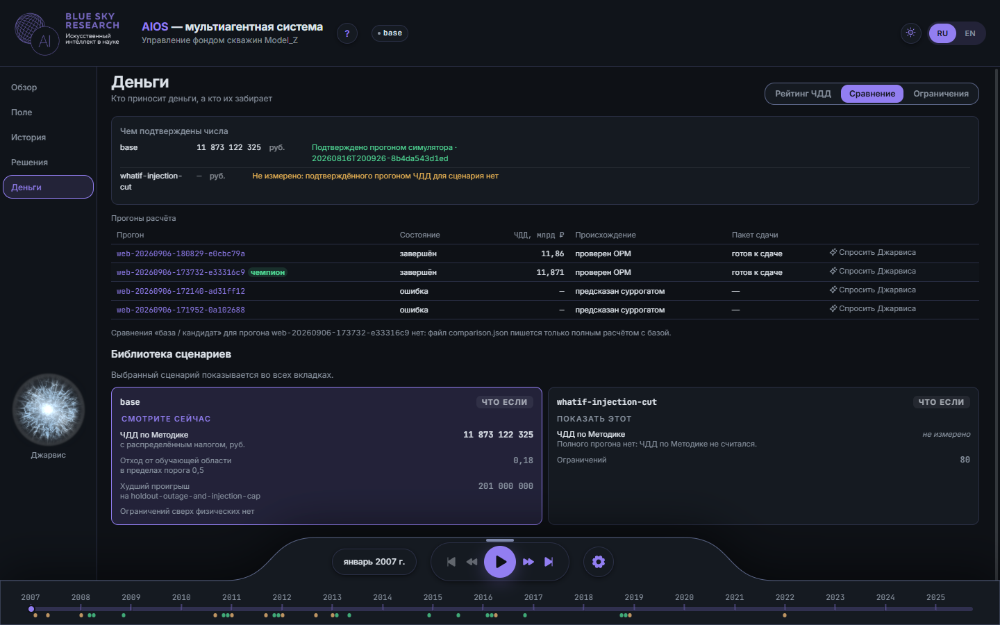
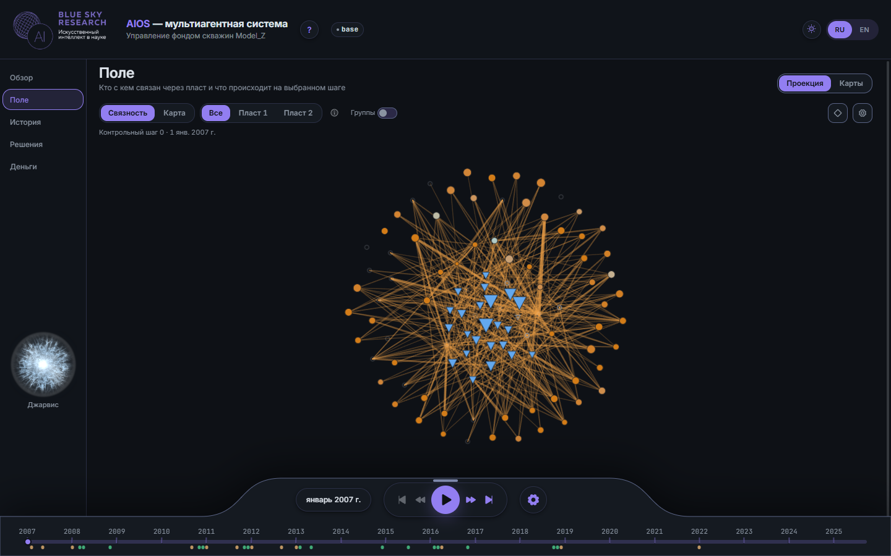
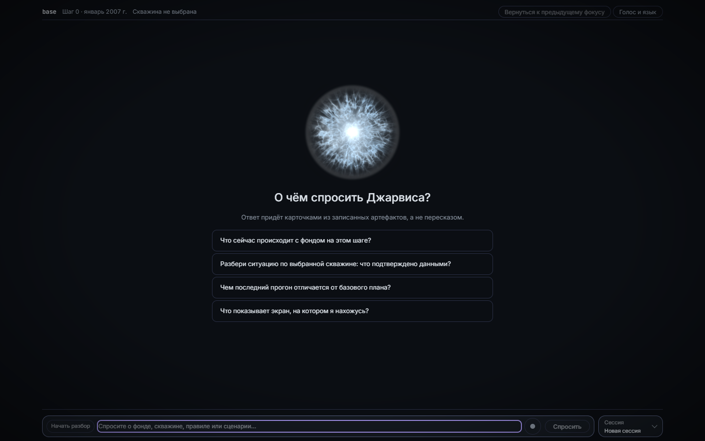

<p align="center">
  <a href="https://aios.goatwhistle.ru/">
    <picture>
      <source media="(prefers-color-scheme: dark)" srcset="docs/brand/wordmark-dark.svg"/>
      
    </picture>
  </a>
</p>

<p align="center">
  <b>Мультиагентная система управления фондом скважин Model_Z.</b><br/>
  Суррогат предлагает. OPM Flow решает. Пакет сдачи не соберётся, если они разошлись.
</p>

<p align="center">
  <a href="https://aios.goatwhistle.ru/"></a>
</p>

<p align="center">
  <a href="#идея"></a>
  <a href="#три-решения"></a>
  <a href="#как-это-работает"></a>
  <a href="#посмотреть-за-две-минуты"></a>
  <a href="#что-измерено"></a>
  <a href="#запустить"></a>
  <a href="#джарвис"></a>
  <a href="#границы-сказанные-первыми"></a>
</p>

<p align="center">
  
  
  
  
  
  
</p>

<p align="center">
  <a href="https://aios.goatwhistle.ru/"></a>
</p>

---

## Идея

Полный гидродинамический прогон Model_Z в OPM Flow занимает **около 640 секунд**
(`verification_seconds` в [`artifacts/surrogate-hybrid-ab-20260910/direct-head-control.json`](artifacts/surrogate-hybrid-ab-20260910/direct-head-control.json)
— 643,519 с, и 637,545 с в [`hybrid-top.json`](artifacts/surrogate-hybrid-ab-20260910/hybrid-top.json) рядом).
Оценка того же расписания быстрой моделью — **около 1,5 секунды**
(`inference_seconds`, шесть строк в [`artifacts/surrogate-screen-20260910/retrospective-audit.json`](artifacts/surrogate-screen-20260910/retrospective-audit.json):
от 1,450 до 1,571 с). Поиск, который перебирает десятки вариантов, возможен только на второй цифре.

Но быстрая модель уверенно ошибается ровно там, где это опаснее всего. В том же аудите
есть строки с `inside_domain: false`, где предсказанный ЧДД равен **−18 668 131 086 ₽** при
измеренном **1 464 123 030 ₽**. Модель не сомневалась; она просто оказалась за пределами
того, что видела.

> **Отсюда единственное правило проекта: ни одно число не произносится со слов суррогата.**
> Суррогат отбирает кандидатов. Каждый финалист заново прогоняется настоящим OPM Flow,
> проверяется на ограничениях, и его ЧДД пересчитывается по эталонной методике организаторов
> на отклике симулятора — не на прогнозе.

Правило имеет исполнительный механизм, а не только формулировку. Сборка пакета сдачи
отказывается идти, если заявленный ЧДД не равен пересчитанному, и статус `ready_to_submit`
ставит **только** `aios run submit` — только после того, как пакет собран и его круговая
проверка сошлась ([`workflow.py`](backend/contexts/runs/application/workflow.py)).

## Три решения

<table>
<tr>
<td valign="top" width="33%">

**Прогноз — не результат**

В прогоне хранятся два разных поля: `predicted_npv` от суррогата и `verified_npv` от OPM.
В [`evaluations.json`](artifacts/final-readiness-20260909/evaluations.json) кампании 09.09
у всех 89 записей `predicted_npv_rub: null` — заявляемая величина берётся только из второго
поля. Консоль показывает это различие в колонке «Происхождение»: «проверен OPM» против
«предсказан суррогатом».

</td>
<td valign="top" width="33%">

**Сходимость OPM — не допуск**

`sound=true` требует больше, чем успешное завершение Flow. Диагностический прогон
`jarvis-policy-20260926` завершился OPM `OK` и при этом получил `sound=false`: 165
блокирующих нарушений водного баланса. Из 89 оценённых кандидатов кампании 09.09
до `sound=true` дошли **пять**.

</td>
<td valign="top" width="33%">

**Вне обученной области — до OPM не доходит**

Порог области применимости по умолчанию — `CONSERVATIVE_OOD_THRESHOLD = 0.0`
([`ood_calibration.py:14`](backend/contexts/optimization/infrastructure/ood_calibration.py)):
любой узел за границами обучающего диапазона отклоняет кандидата. Это сознательно
консервативно, потому что кривая калибровки построена на двух точках и сама помечена
`curve_is_reliable: false`.

</td>
</tr>
</table>

## Как это работает

Поиск идёт тысячами итераций на суррогате, подтверждение — единицами запусков на OPM.
Шесть схем, снятых с кода, а не нарисованных по замыслу, — в
[архитектуре](docs/architecture.md): общая картина, сквозной прогон, четыре гейта отбора,
иерархия агентов политики, Джарвис и развёртывание.



Решение принимает не один агент, а уровни: поле балансирует закачку и отбор, группа
распределяет квоты по участкам, скважина выбирает режим. Каждое решение попадает в след
([`backend/contexts/policy/domain/trace.py`](backend/contexts/policy/domain/trace.py)), поэтому инженер видит,
**почему** был выбран именно этот режим — или что причина не записана. Как устроен суррогат
и чем он не является — [surrogate.md](docs/surrogate.md); слои и границы контекстов —
[architecture.md](docs/architecture.md).

<p align="center">
  
</p>

<p align="center"><sub>Экран <code>/money/comparison</code>. Колонка «Происхождение» отделяет проверенное от
предсказанного построчно; сценарий без полного прогона честно помечен «не измерено», а не нулём.</sub></p>

## Посмотреть за две минуты

Консоль работает на заранее собранной витрине в git — ни одного прогона OPM для этого не нужно.

| Шаг | Открыть | Что видно |
|---|---|---|
| 1 | [`/overview`](https://aios.goatwhistle.ru/overview) | Накопленный ЧДД, компенсация, отбор, закачка и обводнённость за все 225 управляющих шагов |
| 2 | [`/field/projection`](https://aios.goatwhistle.ru/field/projection) | Измеренный граф связности λ: кто с кем связан через пласт |
| 3 | [`/field/maps`](https://aios.goatwhistle.ru/field/maps) | Карты дека Model_Z: пористость, проницаемость, песчанистость — два пласта, k 1–26 и k 29–53 |
| 4 | [`/money/comparison`](https://aios.goatwhistle.ru/money/comparison) | Происхождение каждого числа построчно; чемпион отмечен |
| 5 | Сфера Джарвиса | Вопрос словами — сцена из карточек с происхождением каждого числа |

Маршрут с тем, что именно доказывает каждый шаг, и где отвечен каждый критерий оценки, —
в [руководстве для жюри](docs/for-judges.md).

<p align="center">
  
</p>

<p align="center"><sub>Шаг 2. Рёбра — измеренная связность λ, а не нарисованная схема; у каждого есть
собственное происхождение.</sub></p>

## Что измерено

Каждое число ниже прослеживается до файла в этом репозитории. Полный список утверждений
с градацией «измерено / проверено / принято на веру» — на [странице доказательств](docs/evidence.md).

| Величина | Что показывает | Источник |
|---|---|---|
| Чемпион **2 754 126 065,49 ₽** против базы **1 464 123 030,44 ₽** | Оба числа — от OPM, на одних и тех же хешах кейса, дека и методики | [`evaluations.json`](artifacts/final-readiness-20260909/evaluations.json), `candidate-008` и `candidate-005` |
| `measured_npv` == `npv_methodology` == 1 464 123 030,4381707, `sound: true` | Холодный повтор из чистого клона воспроизвёл ЧДД бит в бит | [`artifacts/final-readiness-20260909/cold-repeat/candidate-005/economics/result.json`](artifacts/final-readiness-20260909/cold-repeat/candidate-005/economics/result.json) |
| 5 из 89 кандидатов получили `sound=true` | Допуск — редкое событие, а не формальность | [`evaluations.json`](artifacts/final-readiness-20260909/evaluations.json) |
| ≈1,5 с против ≈640 с на одно расписание | Во столько раз поиск дешевле проверки | `inference_seconds` и `verification_seconds` в [`artifacts/`](artifacts/) |
| 13 контекстов, списки исключений пусты | Границы слоёв держит машина, а не договорённость | [`test_context_boundaries.py`](tests/architecture/backend/test_context_boundaries.py) |
| 71 термин, 11 экранов, 18 узлов карты, 536 фрагментов | База знаний Джарвиса, отдаваемая `/api/jarvis/health` | [`frontend/public/jarvis/knowledge/`](frontend/public/jarvis/knowledge) |

Поле: **103 скважины, 2 пласта**, горизонт с 01.01.2007, 224 интервала управления
([`config/horizon-model-z.json`](config/horizon-model-z.json); консоль показывает 225 шагов,
включая терминальный). Как это воспроизвести — [verification.md](docs/verification.md).

## Запустить

```bash
python3 -m venv .venv
.venv/bin/pip install -e '.[dev,ml]'
aios selfcheck
```

`aios selfcheck` печатает, что нашлось на этой машине: данные организаторов, дек
`Model_Z_sch.inc`, эталонный расчётчик, нормативы, собранный фронт, Docker, `numpy` и `torch`.
По её выводу сразу видно, какие команды запустятся.

```bash
aios web                          # консоль на http://localhost:8000
aios run search --run-id <id>     # поиск на суррогате
aios run verify --run-id <id>     # проверка настоящим OPM
aios run submit  --run-id <id>    # пакет сдачи, если ЧДД сошлись
```

Свежий клон **неполон по замыслу**: ни веса, ни датасеты, ни данные организаторов в git не
хранятся. Витрина `frontend/public/data/` лежит в репозитории, поэтому консоль и Джарвис
работают без единого прогона OPM. Что требует внешних артефактов, какие переменные окружения
за что отвечают и как перенести сервис на сервер — в [руководстве по запуску](docs/running.md).

> **Windows.** Вывод русскоязычный, консоль по умолчанию в cp1252 — команды падают с
> `UnicodeEncodeError`. Ставьте `PYTHONIOENCODING=utf-8`; интерпретатор здесь —
> `.venv/Scripts/python.exe`.

## Джарвис

Визуальный ассистент консоли: вопрос словами — сцена из карточек. Карточка несёт данные,
происхождение и возможное действие, открывающее нужный экран. 27 предметных инструментов
читают ту же JSON-витрину, что и фронт; поиск по документации — BM25 на чистой стандартной
библиотеке, без внешних зависимостей.

<p align="center">
  
</p>

<p align="center"><sub>Экран до первого вопроса. Ответ приходит карточками из записанных артефактов,
а не пересказом: число без опоры на данные карточек сторож из текста удаляет.</sub></p>

Джарвис объясняет план и результаты. Он не управляет скважинами и не вычисляет заявляемый ЧДД.
Устройство, инструменты и границы — в [jarvis.md](docs/jarvis.md).

## Границы, сказанные первыми

- **«Суррогат» — это составное имя, и нейросеть в нём отвечает не за деньги.** Ансамбль из
  трёх сетей предсказывает траектории по скважинам; скалярный ЧДД даёт отдельная голова
  на ядерной гребневой регрессии, и итог смешивается как `(1−w)·прямая оценка + w·экономика
  предсказанной траектории` ([`economics_prediction.py:23`](backend/contexts/optimization/application/economics_prediction.py)).
  Называть работающую модель графовой нейросетью нельзя: полный граф λ в сеть не подаётся.
- **Заголовочные метрики качества суррогата не имеют опоры в данных этого репозитория.**
  Spearman 0,8602, precision@5 0,80, MAE 42,61 млн ₽ существуют в тексте
  `SURROGATE_DEFENSE.md`, но файла out/metrics-full-pipeline.json, который их печатает,
  на диске нет. Единственный метрический артефакт, который есть, сообщает другое и слабее:
  попарная точность 0,667 на шести прогонах, и сам помечает себя диагностикой.
- **Сравнение ЧДД корректно только при одинаковых условиях.** Кейс, период, дек, нормативы и
  методика должны совпадать; именно поэтому в прогоне и пакете сохранены хеши. Числа из
  разных кампаний в одну таблицу не ставятся.
- **Коридор компенсации 0,85–1,15 — не требование организаторов.** В
  [`competition-constraints.json`](config/competition-constraints.json) у него
  `compensation_enforcement: "diagnostic"`, и годовых лимитов там нет вовсе.
- **Исторические метрики не переносятся на новое месторождение.** OOD-фильтр отклоняет
  неподтверждённые режимы; он не делает прогноз на них точным.
- **Джарвис зависит от внешнего LLM-шлюза.** Без ключа или при его исчерпании сервис
  отвечает честной ошибкой, а не заготовленным текстом: автоматического воспроизведения
  фикстур в продукте нет.

Каждая граница целиком, с тем что измерено, что её удерживает и что остаётся открытым, —
в [limitations.md](docs/limitations.md).

<p align="center"><sub>Трек 2 · управление фондом скважин Model_Z · <a href="LICENSE">лицензия</a></sub></p>
