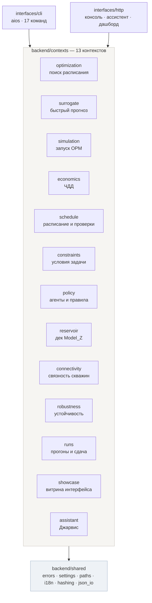
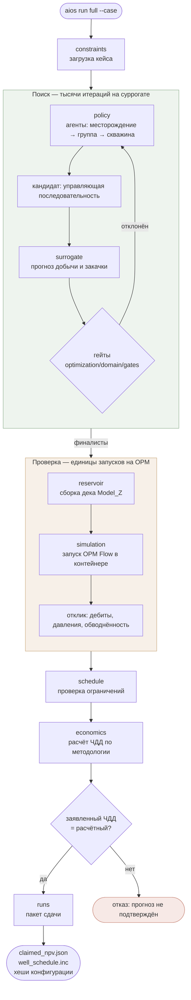
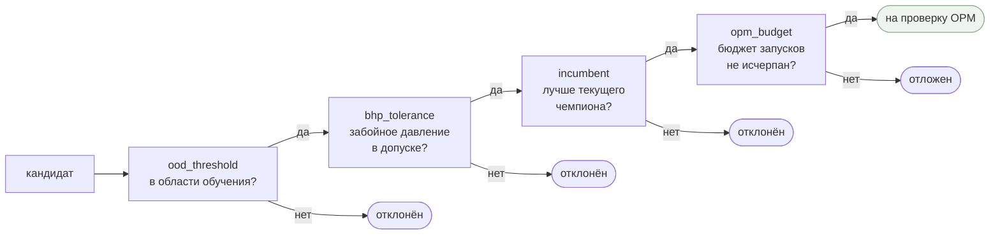
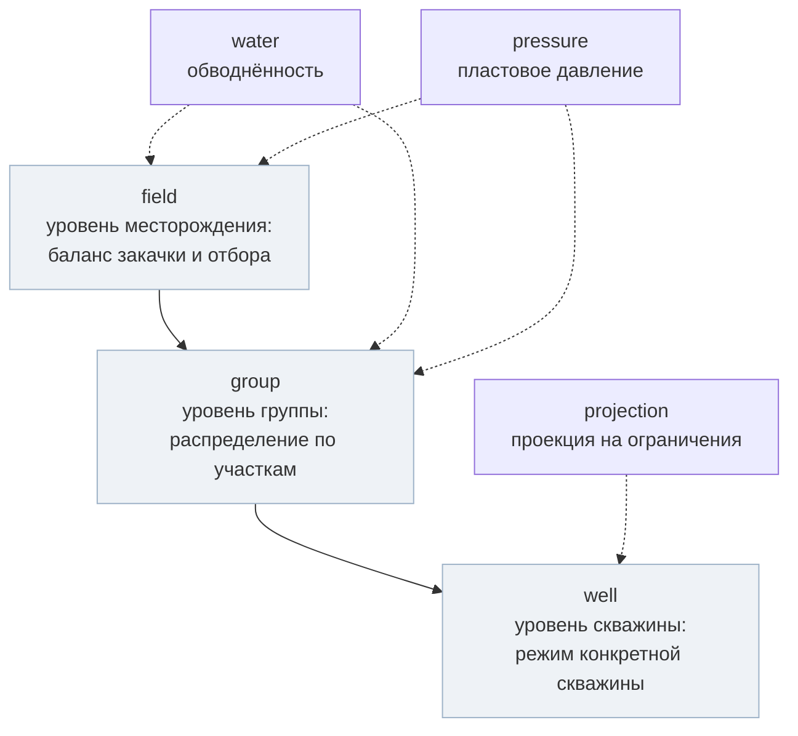
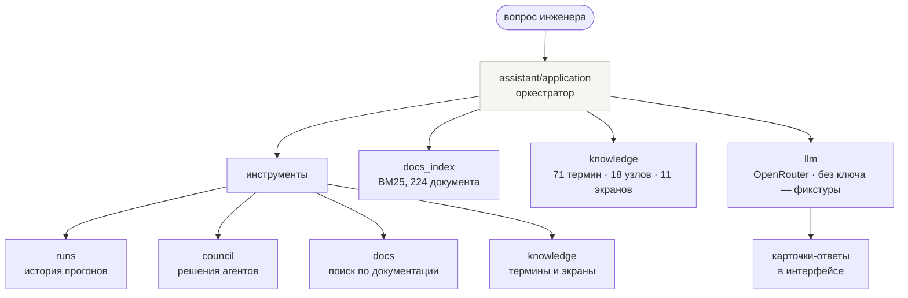
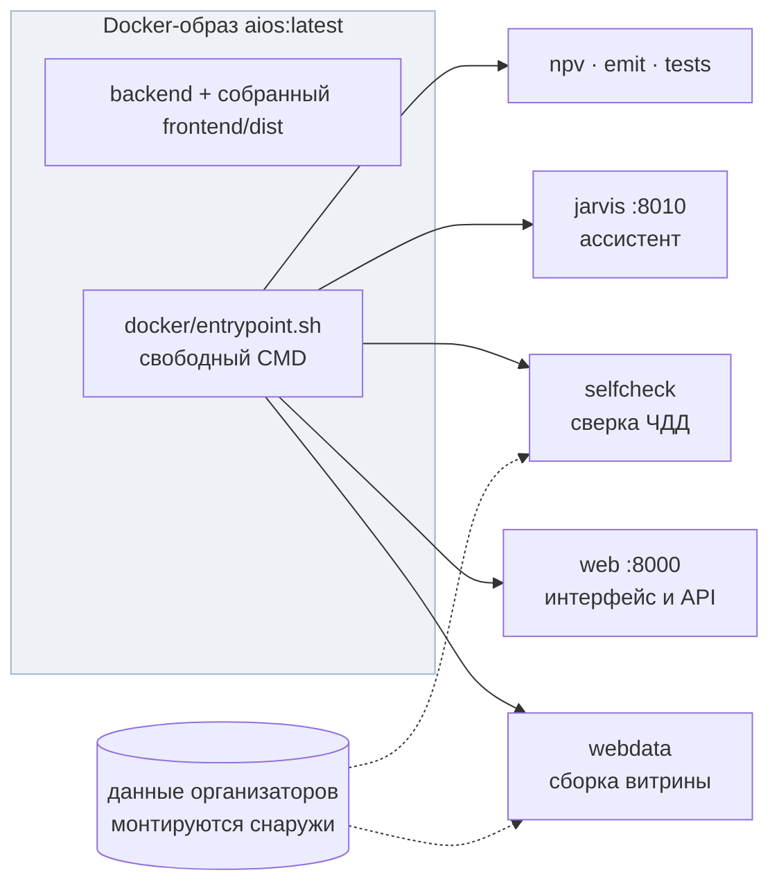

# Архитектура

> Один принцип: код, описывающий пласт, разработку и экономику, не знает, как устроены
> Docker, OPM, браузер и LLM-клиент. Всё остальное — следствия. Тринадцать ограниченных
> контекстов, в каждом `domain / application / infrastructure`, и стрелки зависимостей
> идут только вниз. Это не пожелание в документе: списки исключений в архитектурном тесте
> объявлены пустыми.
>
> Схемы ниже снимались с кода, а не рисовались по замыслу: имена модулей в блоках —
> настоящие пути в репозитории.

**Читайте это, если меняете код или хотите понять, почему файл лежит именно здесь** ·
**Рядом:** [суррогат](surrogate.md) · [Джарвис](jarvis.md) · [проверка](verification.md)

---

## Общая картина

Три слоя: точки входа, тринадцать ограниченных контекстов, общее ядро.

```text
backend/
  shared/          общее ядро; не знает ни одного контекста
  contexts/        13 ограниченных контекстов, в каждом domain/application/infrastructure
  interfaces/      cli/ и http/ — единственные точки входа снаружи
frontend/src/      слайсы app → pages → features → entities → shared + самодостаточный jarvis
tests/             единый корень: architecture, backend, frontend, golden, support, fixtures
```

Бэкенд-кода вне `backend/` нет. Временные пакеты верхнего уровня и слои `core/`, `domain/`,
`ml/`, `infrastructure/`, `application/`, `presentation/` удалены полностью — их
возвращение ловит [`tests/architecture/test_layers.py`](../tests/architecture/test_layers.py).

## Общее ядро

| Модуль | Что внутри |
|---|---|
| `errors.py` | `AiosError` и всё семейство |
| `settings.py` | `Settings.from_env()` — единственное место, где читается `os.environ` |
| `paths.py` | `project_root`, `data_root`, `out_root`, `docs_root` — одна реализация на репозиторий |
| `clock.py` | `Clock` (Protocol), `SystemClock`, `FrozenClock` — детерминизм меток времени |
| `hashing.py` | JCS-канонизация, `content_hash`, `canonical_hash(payload)` |
| `json_io.py` | `read_json`, `read_optional_json`, `write_json` (атомарно, `sort_keys`) |
| `i18n/` | `Messages.get(key, lang, **params)`, `ru.json` / `en.json` |
| `types.py` | `Lang`, `WellId`, `ControlStep` и прочие типы-обёртки |
| `numeric.py`, `resources.py` | Численные помощники и доступ к упакованным ресурсам |

`shared` не импортирует ни `contexts`, ни `interfaces` — это проверяется деревом импортов
и держится без единого нарушения.

## Тринадцать контекстов

Колонка «может зависеть от» — разрешённые направления; всё, чего в ней нет, — нарушение.

| Контекст | Чем владеет | Может зависеть от |
|---|---|---|
| `reservoir` | Модель Z: сетка, скважины, PVT, горизонт, разбор дека | `shared` |
| `schedule` | Агрегат `Schedule`: события, канон, эмит, динамическая валидация | `shared`, `reservoir` |
| `economics` | ЧДД, нормативы, леджер, декомпозиция, паритет с эталоном | `shared`, `reservoir`, `schedule` |
| `constraints` | Кейсы, ограничения, схема, загрузка и выгрузка | `shared`, `reservoir` |
| `connectivity` | λ: измерение, группы, кампания, DOE | `shared`, `reservoir`, `schedule` |
| `policy` | Агенты, правила R0–R7, уровни поля / участка / скважины, след решений | `shared`, `reservoir`, `schedule`, `economics`, `constraints`, `connectivity` |
| `robustness` | OOD-батарея, regret, возмущения | `shared`, `schedule`, `constraints` |
| `surrogate` | Быстрая модель: сеть, признаки, обучение, инференс, физпроверки | `shared`, `reservoir`, `schedule`, `economics` |
| `simulation` | OPM: раннер, preflight, кэш, бюджет, загрузка отклика | `shared`, `reservoir`, `schedule` |
| `optimization` | Алгоритм поиска, среда оценки, гейты, верификация, чемпион | `shared`, доменные контексты выше, `surrogate`, `simulation` |
| `runs` | Жизненный цикл прогона: воркфлоу, манифесты, провенанс, пакет сдачи | `shared`, `optimization`, `simulation`, `constraints`, `showcase` |
| `assistant` | Джарвис: сессии, инструменты, знания, индекс документов, сторож, голос | `shared`, `runs`, `constraints`, `policy`, `connectivity`, `showcase` |
| `showcase` | Сборка JSON-витрины для фронта | `shared`, `reservoir`, `schedule`, `economics`, `connectivity`, `policy`, `runs` |

Пакет внутри контекста заводится, когда в нём появляется первый файл. Поэтому у `policy` и
`robustness` нет `infrastructure/`, а у `showcase` — `domain/`. Каталог с одним пустым
`__init__.py` — мусор, а не архитектура.

```text
contexts/<name>/
  __init__.py          публичный API контекста: только то, что импортируется снаружи
  domain/              сущности, объекты-значения, доменные сервисы, порты (Protocol), errors.py
  application/         сценарии использования, DTO, оркестрация портов
  infrastructure/      адаптеры портов: файлы, Docker, HTTP-клиенты, torch
```

## Правило, которое решает споры

**Вниз по стрелке можно, вверх нельзя.** Если компоненту нужно знать о слое выше, он лежит
не там.

- `shared` не импортирует ни один контекст и ни один интерфейс.
- `contexts/X/domain` импортирует только `shared` и `contexts/Y/domain` для разрешённых `Y`.
  **Никогда** — `application` или `infrastructure` любого контекста, включая свой.
- `contexts/X/application` импортирует `shared`, свой `domain`, свой `infrastructure`
  только через порты, и чужой контекст **только через `contexts/<Y>/__init__.py`**.
- `contexts/X/infrastructure` импортирует `shared`, свой `domain` и порты своего `application`.
- `interfaces` импортирует `shared` и `contexts/*/__init__.py`.
- `os.environ` / `getenv` встречается только в `backend/shared/settings.py`.
- `raise SystemExit` — только в `backend/interfaces/cli/runner.py`.
- Импорты внутри функций запрещены, кроме необязательных зависимостей
  (`torch`, `edge_tts`, `openpyxl`, `anthropic`) в `infrastructure`.
- Кириллица в `backend/**/*.py` запрещена, кроме `shared/i18n/*.json` и ресурсов промптов.
- Комментариев и докстрингов нет нигде. Выживают только `# type: ignore`, `# noqa`,
  `# pragma: no cover`. Импорты вверху файла, типы обязательны.

Когда прямой импорт в `domain` создал бы цикл, а тип нужен только для аннотации, —
`if TYPE_CHECKING:` плюс `from __future__ import annotations`. Так сделано в
`backend/contexts/connectivity/domain/measure.py` для `DatasetSample`.

### Состояние правила

Правило смыкается полностью: ни один модуль `domain` не импортирует `application` или
`infrastructure` во время выполнения. Списки
`DOMAIN_IMPORTS_APPLICATION_EXCEPTIONS` и `DOMAIN_IMPORTS_INFRASTRUCTURE_EXCEPTIONS` в
[`tests/architecture/backend/test_context_boundaries.py`](../tests/architecture/backend/test_context_boundaries.py)
объявлены как пустые `frozenset()`. Аннотации под `if TYPE_CHECKING:` разрешены и сторожем
не считаются — он разбирает импорты времени выполнения.

Пустой список исключений — самое сильное утверждение, которое архитектурный тест может
сделать, и его стоит проверять глазами при чтении кода.

## Сквозной прогон: управление → симулятор → ЧДД

Главный поток `aios run full`. Суть решения в том, что поиск идёт по суррогату,
а подтверждение — по настоящему гидродинамическому симулятору.

Полный прогон ГГДМ дорог по времени, суррогат дёшев: ≈640 секунд против ≈1,5. Поиск
перебирает варианты на суррогате, но **ни один результат не принимается на веру**.
Финалисты пересчитываются настоящим OPM, и если заявленный ЧДД не сошёлся с расчётным,
пакет сдачи не собирается. Цифры и их источники — в
[доказательствах](evidence.md#сколько-стоит-один-вариант).

## Четыре гейта отбора

Кандидат проходит их по очереди; каждый умеет отклонить.

`ood_threshold` — защита от главного риска суррогата: модель уверенно ошибается за
пределами обучающей выборки. Кандидат, непохожий на то, что модель видела, до OPM не
доходит. Что именно считает каждый гейт и почему порог выставлен консервативно —
в [surrogate.md](surrogate.md#область-применимости).

## Иерархия агентов политики

Решение принимается не одним агентом, а по уровням — от месторождения к скважине.

Реестр агентов — `backend/contexts/policy/domain/agents/registry.py`. Каждое решение
попадает в след (`backend/contexts/policy/domain/trace.py`), поэтому инженер может увидеть,
**почему** агент выбрал именно этот режим — или что причина не записана.

## Иерархия ошибок

Корень — `AiosError` в `backend/shared/errors.py`: поля `code`, `message`,
`details: Mapping[str, object]` и `as_dict()`.

```text
AiosError
├── DomainError                 нарушение правила предметной области
│   └── ValidationError         входные данные не проходят проверку
├── NotFoundError               прогон, сценарий, скважина, артефакт отсутствуют
├── ConflictError               состояние не позволяет действие
├── ConfigurationError          окружение, настройки, ключи
├── InfrastructureError         файлы, Docker, подпроцессы, сеть
│   └── ExternalServiceError    OpenRouter, Anthropic, edge-tts
└── UnavailableError            функция сознательно недоступна
```

Каждый контекст объявляет свои подклассы в `<context>/domain/errors.py` с фиксированным
`code` вида `schedule.parse`, `economics.normatives`, `runs.not_found`,
`assistant.no_api_key`. Такие файлы есть у одиннадцати контекстов.

Подмешивание встроенных типов запрещено: класс ошибки наследуется от `AiosError` и только
от него. `ValueError` остаётся ровно для одного случая — программист передал аргумент
неверного типа; нарушение бизнес-правила всегда `DomainError` или `ValidationError`.

Перевод в ответ — по одному месту на интерфейс, и больше нигде:

| Ошибка | HTTP | Код выхода CLI |
|---|---|---|
| `ValidationError` | 400 | 2 |
| `NotFoundError` | 404 | 3 |
| `ConflictError` | 409 | 4 |
| `ConfigurationError` | 503 | 5 |
| `UnavailableError` | 503 | 5 |
| `ExternalServiceError` | 502 | 6 |
| `InfrastructureError` | 500 | 6 |
| прочий `AiosError` | 500 | 1 |

Реализация — `backend/interfaces/http/kit/errors.py` и `backend/interfaces/cli/runner.py`.
Тело HTTP-ответа всегда `{"error": code, "message": message, "details": {...}}`. Голый
`Exception` превращается в 500 с `code="internal"` и записью в лог, без утечки текста
наружу. CLI печатает `error[<code>]: <message>` в stderr.

## Интерфейсы

**CLI.** Единая точка входа `backend/interfaces/cli/main.py`, объявленная в
`pyproject.toml` как консольный скрипт `aios`. `main.py` держит таблицу
`COMMANDS: dict[str, str]`, импортирует модуль лениво и отдаёт его `main` в `runner.run`.
Семнадцать подкоманд:

```text
campaign   emit   jarvis   npv   run   selfcheck   showcase   verify-reference   web
surrogate-adapt   surrogate-adapt-audit   surrogate-audit   surrogate-check
surrogate-release   surrogate-screen   surrogate-screen-verify   surrogate-weight-soup
```

Команда — это разбор аргументов, вызов одного сценария использования и печать результата.
Ни загрузчиков, ни бизнес-правил в ней нет. Старая форма
`python -m backend.presentation.cli.X` не поддерживается.

**HTTP.**

```text
interfaces/http/kit/                 JsonResponse, errors.py, sse.py, body.py (лимиты), cors.py
interfaces/http/console/             статика, /api/runs, прокси Джарвиса
interfaces/http/assistant/           health, ask, cancel, briefing, sessions*, speak, voices, transcribe
interfaces/http/surrogate_dashboard/ сервер и HTML-шаблон как ресурс
```

В `interfaces/http/assistant/` лежат только маршруты, лимиты тел и CORS; вся логика
ассистента — в контексте `assistant`. Логирование настраивается в
`backend/interfaces/logging_setup.py` — один конфигуратор на процесс.

## Фронт

```text
frontend/src/
  app/         запуск: main.tsx, App.tsx, providers/, router/, hotkeys/, styles/
  pages/       11 экранов, один экран — одна папка
  features/    9 возможностей с состоянием
  entities/    предметные сущности: types + validate + model + hooks
  shared/      lib/, ui/, theme/, i18n/, api/, router/ — ничего не знает о фичах
  jarvis/      самодостаточный слайс
```

Направление зависимостей: `app → pages → features → entities → shared`, без стрелок вверх
и без циклов. Слой `widgets` устранён: то, что было виджетом, разошлось по `features`
(если у него есть состояние) и по `shared/ui` (если состояния нет).

Файлы фронта ≤ 250 строк, файлы бэкенда ≤ 400 строк. Идентификаторы, aria-строки и
сообщения — через ключи i18n, не литералами.

## Объяснимость: Джарвис

Отдельный контекст, который отвечает на вопросы по системе и показывает, что происходило
в прогоне.

RAG собран на чистой стандартной библиотеке — без внешних зависимостей. Индексируются
Markdown репозитория, каталог `docs/` и соседний репозиторий документации.

```text
frontend/src/jarvis/                       браузер: сфера, сцены, карточки
          │  SSE  /api/jarvis/*
backend/interfaces/http/assistant/         маршруты, лимиты тел, CORS
backend/contexts/assistant/application/    оркестратор, инструменты, брифинг, подсказки
backend/contexts/assistant/domain/         сессия, сцена, сторож, порты инструментов
backend/contexts/assistant/infrastructure/ LLM-провайдеры, индекс документов, знания, диск, TTS, STT
```

`assistant/application` получает `ChatClient` снаружи и не импортирует ни `urllib`, ни
`http`, ни `anthropic`. Сервис поднимается отдельным процессом и отдельным сервисом
compose на порту 8010, на `ThreadingHTTPServer`, с chunked `text/event-stream` и
комментарием `: keep-alive` каждые 15 секунд, чтобы ленивые прокси не рвали долгий ответ.

Внутрь слайса ходят только `features/ask-jarvis`, `features/workspace-nav` и `app`, и
только через `frontend/src/jarvis/index.ts`. Граница жёсткая, и это проверяемое свойство:
оно защищает продукт, если ассистент не успеет к сроку. Чтобы выключить Джарвиса целиком,
достаточно удалить `frontend/src/jarvis/`, `frontend/public/jarvis/`,
`backend/contexts/assistant/`, `backend/interfaces/http/assistant/` и
`backend/interfaces/cli/jarvis.py`, после чего снять четыре точки вызова: прокси и ветки
`is_jarvis_path` в `backend/interfaces/cli/web.py`, команду `jarvis` в
`docker/entrypoint.sh`, сервис `jarvis` в `docker-compose.yml` и точки монтирования в
`frontend/src/app/` и `features/workspace-nav/`.

Устройство, инструменты и границы ассистента — в [jarvis.md](jarvis.md).

## Развёртывание

Данные организаторов в образ не входят — монтируются томом. Поэтому образ собирается и
запускается на чистой машине, а расчёт требует смонтированных данных. Порядок запуска и
перенос на сервер — в [running.md](running.md).

## Прогон

Каждый прогон изолирован в `out/runs/<run-id>/`:

```text
manifest.json     статус, хеш расписания, предсказанный и проверенный ЧДД
schedule/         каноническое расписание, прошедшее через воркфлоу
prediction/       результат быстрой модели
opm/              рабочий каталог OPM для того же расписания
validation/       корректность, статус OPM, динамические нарушения, тождества
economics/        проверенный ЧДД, когда участок дошёл до экономики
inputs/, ui/      зарезервированные входы и выход для витрины
```

Статусы идут строго `searched` → `verified` (либо `rejected`) → `ready_to_submit`.
Последний ставит **только** `submit` и только после того, как пакет собран и его круговая
проверка сошлась: статус обещает существующий пакет, а не просто корректный прогон.
Подробности — в [verification.md](verification.md).

## Тесты и золотые снимки

Единый корень `tests/`, внутри — по назначению, а не по слою кода:

```text
tests/architecture/   инварианты структуры: границы контекстов, env, слои, ссылки в .md
tests/backend/        contexts/, contracts/, interfaces/, shared/
tests/frontend/       app, design, entities, features, jarvis, knowledge, pages, shared
tests/golden/         снимки поведения до рефакторинга + MANIFEST.json с правилами сверки
tests/support/        помощники и моки для обоих стеков
tests/fixtures/       входные данные (decks/)
```

| Файл снимка | Что гарантирует |
|---|---|
| `showcase.json` | sha256 каждого из 1284 JSON витрины; байт в байт, **кроме** полей `notice` |
| `recordings.json` | sha256 одиннадцати записей Джарвиса |
| `knowledge.json` | sha256 трёх файлов базы знаний |
| `behaviour.json` | ЧДД, пакет чемпиона, сценарии, сетка, статистика таймлайна |
| `api_surface.json` | Публичные символы 226 модулей: ни один не исчезает молча |
| `errors.json` | Имена всех 80 классов ошибок |
| `cli.json` | Коды выхода и сообщения показательных вызовов CLI |
| `tests.json` | Количество тестов по стекам |

**Чего снимки не гарантируют:** это проверка неизменности, а не правильности. Они ловят
регресс рефакторинга — «было одно, стало другое», — но молчат, если поведение было
неверным до снятия. Каждое осознанное обновление пишется в `MANIFEST.json` в раздел
`refreshed` с датой, списком файлов и причиной.

## Как добавить новый контекст

1. Решить, чем контекст **владеет**. Если ответ звучит как «он помогает другому
   контексту», это не контекст, а слой внутри существующего.
2. Завести `backend/contexts/<name>/` с `__init__.py` и пакетом `domain/`. `application/`
   и `infrastructure/` создаются, когда в них появится первый файл, не раньше.
3. Объявить `<context>/domain/errors.py` с фиксированными `code` вида `<name>.<что произошло>`.
4. Описать вход и выход как порты (`Protocol`) в `domain/`. Реализации — в `infrastructure/`.
5. Публичный API — в `__init__.py` контекста.
6. Дописать строку в таблицу контекстов выше.
7. Прогнать `tests/architecture/backend/`.

## Как добавить новый экран

1. `frontend/src/pages/<kebab-case>/` — одна папка на экран.
2. Данные экрана — из `entities/*`; если сущности нет, завести её там, а не в странице.
3. Состояние и взаимодействие — в `features/*`; страница их только собирает.
4. Общие кирпичи — из `shared/ui`.
5. Все тексты и aria-строки — ключами через `shared/i18n`, в `locales/{ru,en}`.
6. Зарегистрировать маршрут в `app/router/`.
7. Тесты — в `tests/frontend/pages/<kebab-case>/`.

---

<p align="center"><sub><a href="README.md">Оглавление документации</a> · <a href="../README.md">README проекта</a></sub></p>
